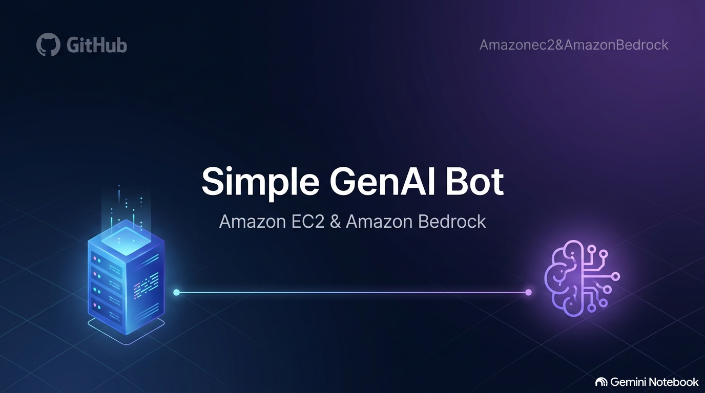

# 🚀 Simple GenAI Bot with Amazon EC2 and Amazon Bedrock



Este repositório contém a documentação completa e o código-fonte para implementar um chatbot web de resposta única (*one-shot* chatbot) na nuvem da **Amazon Web Services (AWS)** [25]. 

O projeto demonstra como configurar uma aplicação web ponta a ponta que recebe uma mensagem do usuário, autentica-se de forma segura usando permissões nativas do IAM e consome o modelo de linguagem avançado **Claude Sonnet 4.5** do **Amazon Bedrock** [1, 25].

---

## 🏗️ Arquitetura do Sistema

O fluxo das requisições e a estrutura dos recursos provisionados seguem o diagrama abaixo:


### 🔄 Fluxo de Execução Técnica
1. **Requisição do Usuário:** O usuário digita uma pergunta na página web simples servida pelo Apache (`httpd`) rodando na porta 80 [6, 14, 30, 31].
2. **Servidor Web & CGI:** O servidor Apache recebe o payload via método `POST` e invoca o script de backend escrito em Python utilizando a interface CGI (*Common Gateway Interface*) [1, 31, 32].
3. **Autenticação IAM Segura:** Em vez de usar credenciais estáticas no código (o que viola as práticas de segurança), a instância EC2 possui um **IAM Role** associado com a política de acesso [25, 29]. O SDK da AWS obtém temporariamente essas credenciais por meio do serviço de metadados da instância [25].
4. **Chamada ao Amazon Bedrock:** O script Python utiliza o SDK **Boto3** para enviar o payload formatado ao serviço Amazon Bedrock na região `us-west-2` (Oregon), chamando o modelo **Claude Sonnet 4.5** via Inference Profile [25, 26, 32].
5. **Retorno da Resposta:** O Bedrock processa a entrada e devolve a resposta gerada, que é formatada dinamicamente pelo script CGI e renderizada no navegador do usuário [1, 33].

---

## 🛠️ Tecnologias e Conceitos Utilizados

*   **Amazon EC2 (t3.micro & Amazon Linux 2023):** Servidor virtual que hospeda o frontend e executa o código de backend de forma econômica e eficiente [26].
*   **Amazon Bedrock (Claude Sonnet 4.5):** Serviço de IA generativa totalmente gerenciado pela AWS [1, 25]. A chamada utiliza parâmetros configurados como `temperature: 0.9` e `max_tokens: 500` [32].
*   **Boto3 SDK:** Biblioteca oficial da AWS para Python que encapsula e simplifica todas as chamadas de API [7]. *Curiosidade técnica:* O nome "Boto" é uma homenagem direta ao boto-cor-de-rosa que vive no Rio Amazonas [7].
*   **Estatelessness (Falta de Estado):** O chatbot básico é um modelo *one-shot*, o que significa que o Claude não retém histórico ou contexto de mensagens anteriores nativamente [1, 2, 25]. Cada envio de texto é uma transação isolada [16].

---

## 💻 Guia Prático de Implementação

### Passo 1: Provisionar a Instância EC2
1. Acesse o console da **AWS** na região de **Oregon (us-west-2)** [26].
2. Vá até o serviço **EC2** e clique em **Launch instance** [26].
3. Nomeie sua máquina e selecione os seguintes parâmetros padrões:
   *   **AMI:** Amazon Linux 2023 [26].
   *   **Instance type:** `t3.micro` (elegível para nível gratuito) [26].
   *   **Key pair:** Selecione a opção **Proceed without a key pair** (acessaremos diretamente via console através do *EC2 Instance Connect*) [27].
4. Em **Network Settings**:
   *   Mantenha a opção **Allow SSH traffic from Anywhere (0.0.0.0/0)** ativa [27].
   *   Marque a caixa de seleção **Allow HTTP traffic from the internet** para liberar o tráfego web público na porta 80 [27].
5. Clique em **Launch instance** [27].

### Passo 2: Configurar a Identidade do IAM (Segurança Nativa)
Para que a instância EC2 possa se comunicar com o Bedrock sem expor chaves de acesso vulneráveis no código [25]:
1. No console AWS, navegue até o **IAM** e clique em **Roles** > **Create role** [28].
2. Escolha **AWS service** e selecione o caso de uso **EC2** [28].
3. Na busca de políticas, procure por **`AmazonBedrockFullAccess`** e adicione-a [28].
4. Avance, dê o nome de `restart-bot-role` e finalize em **Create role** [29].
5. Retorne ao painel do **EC2**, selecione a sua instância, clique em **Actions** > **Security** > **Modify IAM role** [29].
6. Escolha a Role criada e clique em **Update IAM role** para associá-la à máquina [29].

### Passo 3: Configurar o Ambiente de Software (Linux)
1. No console do EC2, clique na sua máquina e selecione o botão azul **Connect** no topo [29].
2. Escolha a aba **EC2 Instance Connect** e clique no botão laranja **Connect** para abrir o terminal [30].
3. Atualize o sistema operacional e instale o Apache, Python 3 e o SDK Boto3 rodando os seguintes comandos [30]:
   ```bash
   # Atualizar pacotes do sistema
   sudo yum update -y

   # Instalar e iniciar o servidor Apache HTTPD
   sudo yum install -y httpd
   sudo systemctl start httpd
   sudo systemctl enable httpd

   # Instalar dependências de execução do Python 3
   sudo yum install -y python3 python3-pip
   sudo pip3 install boto3
   ```

### Passo 4: Criar o Frontend (HTML)
1. No terminal do EC2, crie o arquivo HTML que será a página inicial do bot [31, 32]:
   ```bash
   sudo vi /var/www/html/index.html
   ```
2. Pressione a tecla `i` para entrar no modo de inserção do editor `vi` [32].
3. Cole o código HTML estruturado abaixo [31, 32]:
   ```html
   <!DOCTYPE html>
   <html>
   <head>
       <meta charset="UTF-8">
       <title>Bedrock Text Processing</title>
       <style>
           body { font-family: Arial, sans-serif; margin: 40px; background-color: #f4f6f9; color: #333; }
           h1 { color: #232f3e; }
           textarea { width: 100%; max-width: 600px; padding: 12px; border: 1px solid #ccc; border-radius: 4px; font-size: 14px; }
           input[type="submit"] { background-color: #ff9900; color: white; border: none; padding: 10px 20px; font-size: 14px; border-radius: 4px; cursor: pointer; margin-top: 10px; font-weight: bold; }
           input[type="submit"]:hover { background-color: #ec7211; }
       </style>
   </head>
   <body>
       <h1>Interface de Processamento de Texto - Amazon Bedrock</h1>
       <p>Faça uma pergunta ou envie uma instrução para o modelo Claude Sonnet 4.5:</p>
       <form action="/cgi-bin/process_text.py" method="post">
           <textarea name="user_input" rows="8" placeholder="Digite aqui sua pergunta..."></textarea><br>
           <input type="submit" value="Enviar ao Bedrock">
       </form>
   </body>
   </html>
   ```
4. Salve e saia do editor pressionando `Esc`, digitando `:wq` e apertando `Enter` [32].

### Passo 5: Criar o Script Backend (Python CGI)
1. Crie o arquivo executável que tratará a chamada ao modelo de IA [34]:
   ```bash
   sudo vi /var/www/cgi-bin/process_text.py
   ```
2. Entre no modo de inserção (`i`) e adicione o código Python responsável por gerenciar a lógica e invocar o Bedrock [32, 34]:
   ```python
   #!/usr/bin/env python3
   import cgi
   import cgitb; cgitb.enable()
   import boto3
   import json

   print("Content-Type: text/html; charset=utf-8")
   print()

   form = cgi.FieldStorage()
   user_input = form.getvalue('user_input')

   if user_input:
       # Criação do cliente de runtime do Bedrock na região correta (Oregon)
       bedrock_client = boto3.client('bedrock-runtime', region_name='us-west-2')
       
       # Configuração estruturada da payload exigida pela API do Claude
       request_payload = {
           'anthropic_version': 'bedrock-2023-05-31',
           'max_tokens': 500,
           'temperature': 0.9,
           'top_k': 250,
           'messages': [
               {
                   'role': 'user',
                   'content': user_input
               }
           ]
       }
       
       # Invocação do modelo via SDK Boto3
       response = bedrock_client.invoke_model(
           modelId='global.anthropic.claude-sonnet-4-5-20250929-v1:0',
           body=json.dumps(request_payload)
       )

       # Parsing e extração da resposta do modelo
       result = json.loads(response['body'].read())
       processed_text = "".join([output["text"] for output in result["content"]])

       # Renderização da resposta gerada e reexibição do formulário
       print(f"""
       <h2>Texto Processado pelo Claude Sonnet 4.5:</h2>
       <p style="background-color: #fff; padding: 15px; border-left: 5px solid #ff9900; border-radius: 4px; max-width: 600px; line-height: 1.6;">{processed_text}</p>
       <hr style="max-width: 600px; margin-left: 0;">
       <h3>Enviar outra mensagem:</h3>
       <form action="/cgi-bin/process_text.py" method="post">
           <textarea name="user_input" rows="8" style="width: 100%; max-width: 600px;"></textarea><br>
           <input type="submit" value="Enviar ao Bedrock" style="background-color: #ff9900; color: white; border: none; padding: 10px 20px; font-weight: bold; border-radius: 4px; cursor: pointer;">
       </form>
       """)
   else:
       print("<h2>Nenhum input foi recebido! Por favor, retorne e envie uma mensagem.</h2>")
   ```
3. Salve e saia do editor pressionando `Esc`, digitando `:wq` e apertando `Enter` [34].
4. Aplique permissão de execução ao script Python e reinicie o serviço Apache [34]:
   ```bash
   sudo chmod +x /var/www/cgi-bin/process_text.py
   sudo systemctl restart httpd
   ```

---

## 🧪 Validando a Solução

1. Vá para o Console EC2 da AWS e selecione sua instância rodando [34].
2. Copie o **Public IPv4 address** (IP Público) listado na descrição da instância [34].
3. Abra uma nova aba no seu navegador web e cole o IP copiado (certifique-se de acessar via HTTP comum, ex: `http://SEU-IP-PUBLICO/`) [14, 34].
4. Interaja com a interface web enviando uma mensagem. Na sequência, você receberá a resposta completa do Claude Sonnet 4.5 provando que sua integração funciona com absoluto sucesso [34]!

---

## 🔒 Boas Práticas e Segurança

*   **Princípio do Menor Privilégio (Least Privilege):** Para propósitos deste laboratório educacional rápido, utilizamos a política `AmazonBedrockFullAccess` [5, 25]. Em ambientes reais de produção, configure uma política personalizada do IAM restringindo as chamadas de API apenas aos recursos de inferência específicos e ao modelo (`claude-sonnet-4-5`) que sua aplicação de fato precisa consumir [5].
*   **Segurança de Rede:** Evite expor a porta de administração SSH (22) para toda a internet (`0.0.0.0/0`) [27]. Restrinja o tráfego de entrada apenas para o seu IP público pessoal ou utilize o *EC2 Instance Connect Endpoint* para conexões internas blindadas [4, 27].

---

## 🧹 Limpeza de Recursos (Cleanup)
Para não gerar custos adicionais na sua conta AWS após concluir o laboratório [22]:
1. Retorne ao console do **Amazon EC2** [35].
2. Selecione a instância criada, clique no menu **Instance state** e selecione **Terminate instance** (Excluir máquina) [35].
